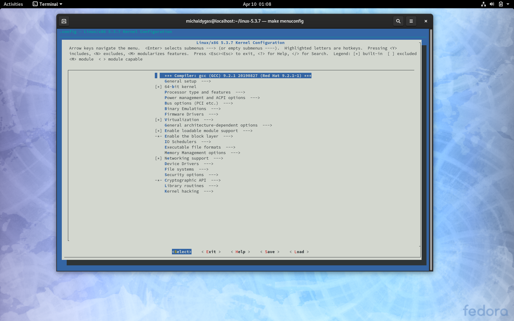
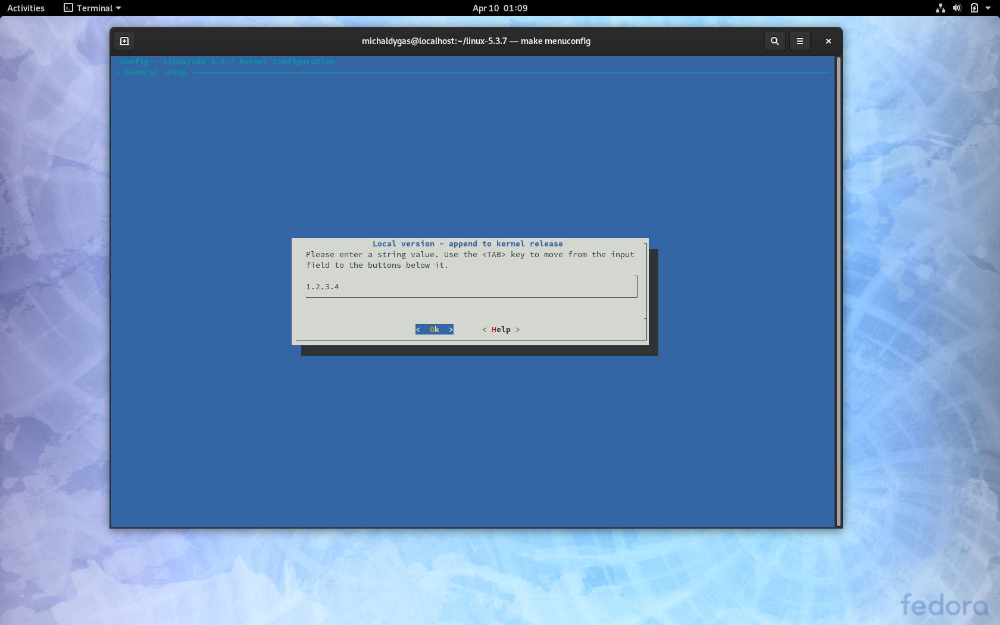
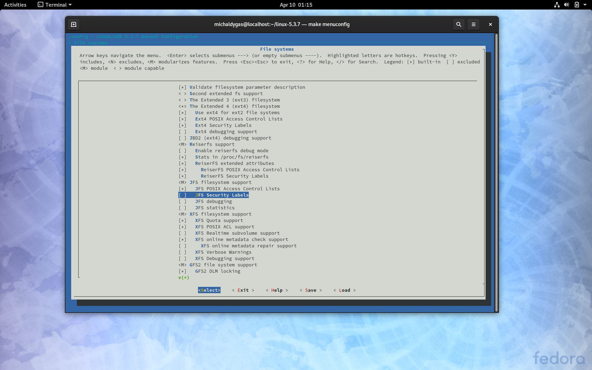
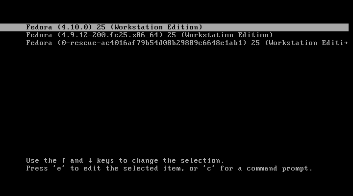
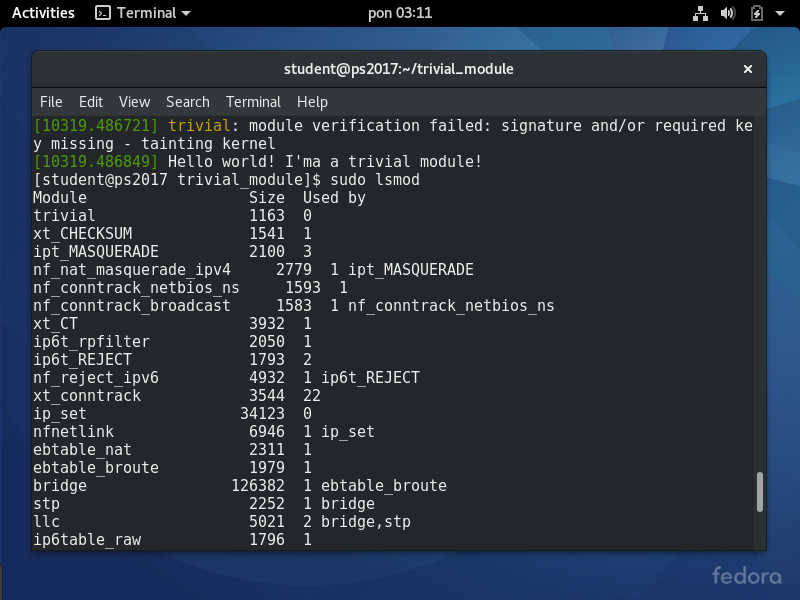
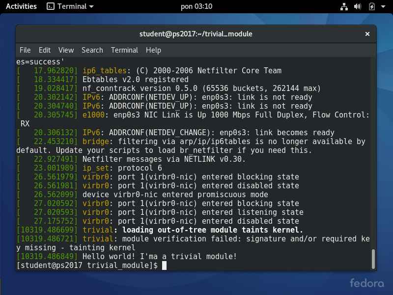
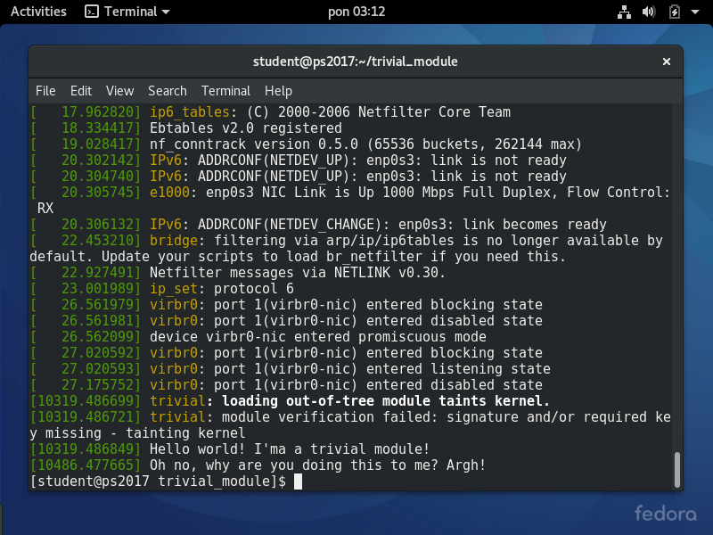
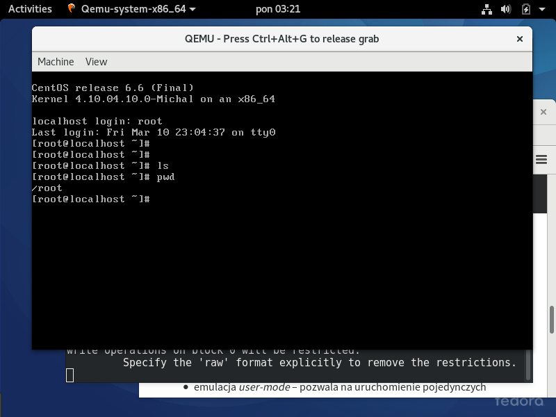
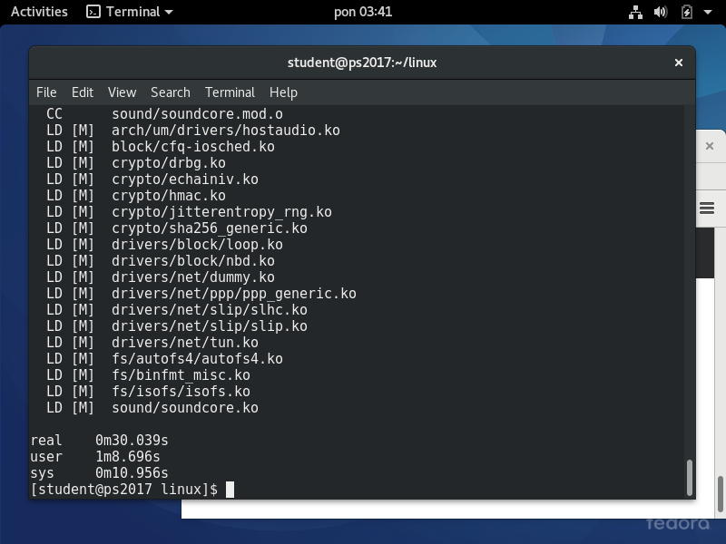
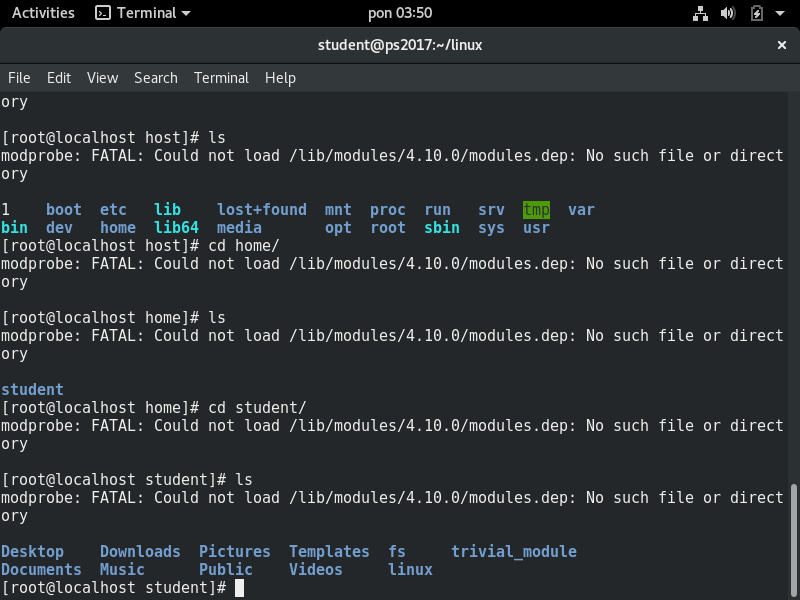

# Sprawozdanie - Wprowadzenie - Michał Dygas

## Zadanie 1 - LXR i dokumentacja
### - Znajdź definicję struktury ```file_operations```. Zapoznaj się z jej polami
```
struct file_operations {
        struct module *owner;
        loff_t (*llseek) (struct file *, loff_t, int);
        ssize_t (*read) (struct file *, char __user *, size_t, loff_t *);
        ssize_t (*write) (struct file *, const char __user *, size_t, loff_t *);
        ssize_t (*read_iter) (struct kiocb *, struct iov_iter *);
        ssize_t (*write_iter) (struct kiocb *, struct iov_iter *);
        int (*iopoll)(struct kiocb *kiocb, bool spin);
        int (*iterate) (struct file *, struct dir_context *);
        int (*iterate_shared) (struct file *, struct dir_context *);
        __poll_t (*poll) (struct file *, struct poll_table_struct *);
        long (*unlocked_ioctl) (struct file *, unsigned int, unsigned long);
        long (*compat_ioctl) (struct file *, unsigned int, unsigned long);
        int (*mmap) (struct file *, struct vm_area_struct *);
        unsigned long mmap_supported_flags;
        int (*open) (struct inode *, struct file *);
        int (*flush) (struct file *, fl_owner_t id);
        int (*release) (struct inode *, struct file *);
        int (*fsync) (struct file *, loff_t, loff_t, int datasync);
        int (*fasync) (int, struct file *, int);
        int (*lock) (struct file *, int, struct file_lock *);
        ssize_t (*sendpage) (struct file *, struct page *, int, size_t, loff_t *, int);
        unsigned long (*get_unmapped_area)(struct file *, unsigned long, unsigned long, unsigned long, unsigned long);
        int (*check_flags)(int);
        int (*flock) (struct file *, int, struct file_lock *);
        ssize_t (*splice_write)(struct pipe_inode_info *, struct file *, loff_t *, size_t, unsigned int);
        ssize_t (*splice_read)(struct file *, loff_t *, struct pipe_inode_info *, size_t, unsigned int);
        int (*setlease)(struct file *, long, struct file_lock **, void **);
        long (*fallocate)(struct file *file, int mode, loff_t offset,
                          loff_t len);
        void (*show_fdinfo)(struct seq_file *m, struct file *f);
#ifndef CONFIG_MMU
        unsigned (*mmap_capabilities)(struct file *);
#endif
        ssize_t (*copy_file_range)(struct file *, loff_t, struct file *,
                        loff_t, size_t, unsigned int);
        loff_t (*remap_file_range)(struct file *file_in, loff_t pos_in,
                                   struct file *file_out, loff_t pos_out,
                                   loff_t len, unsigned int remap_flags);
        int (*fadvise)(struct file *, loff_t, loff_t, int);
} __randomize_layout;
```

### - Spróbuj odnaleźć użycie tej struktury w systemie plików ```hostfs```

```
static const struct file_operations hostfs_file_fops = {
         .llseek         = generic_file_llseek,
         .splice_read    = generic_file_splice_read,
         .read_iter      = generic_file_read_iter,
         .write_iter     = generic_file_write_iter,
         .mmap           = generic_file_mmap,
         .open           = hostfs_open,
         .release        = hostfs_file_release,
         .fsync          = hostfs_fsync,
 };
 
 static const struct file_operations hostfs_dir_fops = {
         .llseek         = generic_file_llseek,
         .iterate_shared = hostfs_readdir,
         .read           = generic_read_dir,
         .open           = hostfs_open,
         .fsync          = hostfs_fsync,
 };

```

```
static int read_name(struct inode *ino, char *name)
 {
         dev_t rdev;
         struct hostfs_stat st;
         int err = stat_file(name, &st, -1);
         if (err)
                 return err;
 
         /* Reencode maj and min with the kernel encoding.*/
         rdev = MKDEV(st.maj, st.min);
 
         switch (st.mode & S_IFMT) {
         case S_IFLNK:
                 ino->i_op = &hostfs_link_iops;
                 break;
         case S_IFDIR:
                 ino->i_op = &hostfs_dir_iops;
                 ino->i_fop = &hostfs_dir_fops;
                 break;
         case S_IFCHR:
         case S_IFBLK:
         case S_IFIFO:
         case S_IFSOCK:
                 init_special_inode(ino, st.mode & S_IFMT, rdev);
                 ino->i_op = &hostfs_iops;
                 break;
         case S_IFREG:
                 ino->i_op = &hostfs_iops;
                 ino->i_fop = &hostfs_file_fops;
                 ino->i_mapping->a_ops = &hostfs_aops;
                 break;
         default:
                 return -EIO;
         }
 
         ino->i_ino = st.ino;
         ino->i_mode = st.mode;
         set_nlink(ino, st.nlink);
         i_uid_write(ino, st.uid);
         i_gid_write(ino, st.gid);
         ino->i_atime = timespec_to_timespec64(st.atime);
         ino->i_mtime = timespec_to_timespec64(st.mtime);
         ino->i_ctime = timespec_to_timespec64(st.ctime);
         ino->i_size = st.size;
         ino->i_blocks = st.blocks;
         return 0;
 }
```
### - Czy potrafisz zinterpretować zastosowanie poszczególnych pól?

Ta struktura przechowywuje wskaźniki na funkcje zdefiniowane przez sterowniki dla systemu plików, które mogą wykonać różne czynności na urządzeniu. W ten sposób zdefiniowany jest polimorfizm dla zwykłych plików, oraz dla urządzeń znakowych.

### - Zlokalizuj w dokumentacji (katalog Documentation lub wyszukiwarka) informacje o tym, jak przechodzić po strukturze katalogów w jądrze

Nie udało mi się znaleźć tego katalogu.

### - Zlokalizuj plik ```namei.h``` a w nim funkcje ```kern_path``` i ```user_path```. Czym się one różnią i kiedy mają zastosowanie?

Obie funkcje zwracają inode dla podanej ścieżki

```
int kern_path(const char *name, unsigned int flags, struct path *path)
{
        return filename_lookup(AT_FDCWD, getname_kernel(name ,flags, path, NULL);
}
```

```
static inline int user_path_at(int dfd, const char __user *name, unsigned flags, struct path *path)
{
    return user_path_at_empty(dfd, name, flags, path, NULL);
}
```

### - Znajdź definicję struktury ```dentry```

```
struct dentry {
          /* RCU lookup touched fields */
          unsigned int d_flags;           /* protected by d_lock */
          seqcount_t d_seq;               /* per dentry seqlock */
          struct hlist_bl_node d_hash;    /* lookup hash list */
          struct dentry *d_parent;        /* parent directory */
          struct qstr d_name;
          struct inode *d_inode;          /* Where the name belongs to - NULL is
                                           * negative */
        unsigned char d_iname[DNAME_INLINE_LEN];        /* small names */

         /* Ref lookup also touches following */
         struct lockref d_lockref;       /* per-dentry lock and refcount */
         const struct dentry_operations *d_op;
         struct super_block *d_sb;       /* The root of the dentry tree */
         unsigned long d_time;           /* used by d_revalidate */
         void *d_fsdata;                 /* fs-specific data */
 
         union {
                 struct list_head d_lru;         /* LRU list */
                 wait_queue_head_t *d_wait;      /* in-lookup ones only */
         };
         struct list_head d_child;       /* child of parent list */
         struct list_head d_subdirs;     /* our children */
         /*
          * d_alias and d_rcu can share memory
          */
         union {
                 struct hlist_node d_alias;      /* inode alias list */
                 struct hlist_bl_node d_in_lookup_hash;  /* only for in-lookup ones */
                 struct rcu_head d_rcu;
         } d_u;
 } __randomize_layout;
```


### - Znajdź funkcję ```dget```. Co ona robi i po co? (Podpowiedź można znaleźć we wcześniej znalezionej dokumentacji.)

Funkcja dget - kopia płytka referencji, wraz z atomowym liczaniem kopii - prawdopodobnie użyteczne przy zwalnianiu pamięci. 


```
/**
  *      dget, dget_dlock -      get a reference to a dentry
  *      @dentry: dentry to get a reference to
  *
  *      Given a dentry or %NULL pointer increment the reference count
  *      if appropriate and return the dentry. A dentry will not be 
  *      destroyed when it has references.
  */
 static inline struct dentry *dget_dlock(struct dentry *dentry)
 {
         if (dentry)
                 dentry->d_lockref.count++;
         return dentry;
 }
 
 static inline struct dentry *dget(struct dentry *dentry)
 {
         if (dentry)
                 lockref_get(&dentry->d_lockref);
         return dentry;
 }

 ```

Komentarz do funkcji ```lockref_get``` 
```
/**
  * lockref_get - Increments reference count unconditionally
  * @lockref: pointer to lockref structure
  *
  * This operation is only valid if you already hold a reference
  * to the object, so you know the count cannot be zero.
  */
  ```
## Zadanie 2

### - Sprawdzenie wersji jądra i pobranie plików źródłowych

```
uname -r
```
output: 5.3.7-301.fc31.x86_64

pobranie plików źródłowych
```
wget https://cdn.kernel.org/pub/linux/kernel/v5.x/linux-5.3.tar.sign 
```


### - Zapoznaj się z zawartością pliku .config

```
#

# Automatically generated file; DO NOT EDIT.

# Linux/x86 5.3.7 Kernel Configuration

#


#

# Compiler: gcc (GCC) 9.2.1 20190827 (Red Hat 9.2.1-1)

#

CONFIG_CC_IS_GCC=y

CONFIG_GCC_VERSION=90201

CONFIG_CLANG_VERSION=0

CONFIG_CC_CAN_LINK=y

CONFIG_CC_HAS_ASM_GOTO=y

CONFIG_CC_HAS_WARN_MAYBE_UNINITIALIZED=y

CONFIG_IRQ_WORK=y

CONFIG_BUILDTIME_EXTABLE_SORT=y

CONFIG_THREAD_INFO_IN_TASK=y

...

```

### - Co robi polecenie ```make oldconfig```? Wykonaj je.

```
oldconfig - Update current config utilising a provided .config as base

olddefconfig - Same as oldconfig but sets new symbols to their
```

### - Co robi polecenie ```make menuconfig```? Wykonaj je.



```
menuconfig - Update current config utilising a menu based program
```
### - Ustaw dowolną, ale charakterystyczną wersję lokalną 



```
[michaldygas@localhost linux-5.3.7]$ cat .config | grep CONFIG_LOCALVERSION 

CONFIG_LOCALVERSION="1.2.3.4"

```

### - Zrób małą zmianę w konfiguracji (np. włącz obsługę któregoś systemu plików).



### - Co robi polecenie ```make all```?

```
all  - Build all targets marked with [*]
```
### - Co robią polecenia ```make modules_install``` i ```make install```?

```
modules_install - Install all modules to INSTALL_MOD_PATH (default: /)

install - Install kernel using (your) ~/bin/installkernel or (distribution) /sbin/installkernel or install to $(INSTALL_PATH) and run lilo
```

### Instalacja

```
real	20m8.032s

user	55m52.311s

sys	8m14.000s
```



## Zadanie 3 - kompilacja modułu

### - Załaduj: ```insmod```.

```
sudo insmod trivial.ko
```

### - Wylistuj moduły:```lsmod```.



### - Obejrzyj komunikaty jądra: ```dmesg```.



### - Usuń ```rmmod```.

```
sudo rmmod trivial
```
### - Jeszcze raz obejrzyj komunikaty jądra.


## Zadanie 4 - QEMU


## Zadanie 5 - kompilacja jądra UML

### - Wykonaj komendę ```make ARCH=um defconfig```. Co ona robi?

```
defconfig - New config with default from ARCH supplied defconfig
```

### - Skompiluj jądro komendą        ```make ARCH=um```. Ile czasu zajęła kompilacja?



### - Uruchom ```./vmlinux ubd0=~/fs/CentOS6.x-AMD64-root_fs```.

### - Zamontuj hostfs za pomocą komendy: ```mount none /host -t hostfs```. (Jeżeli katalog /host nie istnieje, to go utwórz.) Co pojawiło się po zamontowaniu tego systemu plików?



Widoczne jest drzewo katalogów hosta

### -Jakie procesy są widoczne w gościu i po stronie hosta?
    
Host widzi procesy gościa, natomiast w drugą stronę nie.